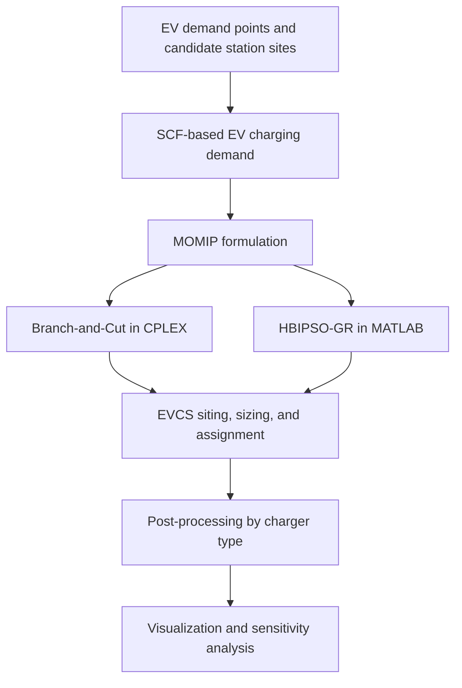

# EV Charging Station Siting and Sizing Optimization

This repository contains research code for **electric vehicle charging station (EVCS) siting and sizing** using mixed-integer optimization and metaheuristic search. The case study is based on a representative urban development area in Phu Quoc, Vietnam, and supports early-stage planning of EV charging infrastructure under spatial service-distance and station-capacity constraints.

The workflow combines:

- **SCF-based EV charging demand conversion**
- **Multi-objective mixed-integer programming (MOMIP)**
- **Branch-and-Cut optimization using IBM ILOG CPLEX**
- **Hybrid Binary-Integer Particle Swarm Optimization with Greedy Repair (HBIPSO-GR)**
- **Post-processing of charging-station capacity into 11 kW, 60 kW, and 150 kW charger groups**
- **Visualization and service-distance sensitivity analysis**

---

## 1. Research Scope

The EVCS planning problem is formulated to determine:

1. which candidate charging-station sites should be used,
2. how many charging units should be installed at each station,
3. how EV charging demand points should be assigned to available stations.

The optimization model considers three planning objectives:

- **F1 — Demand coverage:** maximize served EV charging demand.
- **F2 — Load balance:** reduce load imbalance among charging stations.
- **F3 — Land-use footprint:** minimize total station area or installed charging-stall footprint.

The weighted objective is expressed in minimization form as:

\[
\min Z = -w_1 \hat{F}_1 + w_2 \hat{F}_2 + w_3 \hat{F}_3
\]

where \(\hat{F}_1\), \(\hat{F}_2\), and \(\hat{F}_3\) are normalized objective terms.

---

## 2. Repository Structure

Recommended structure for the public GitHub repository:

```text
evcs-siting-sizing-momip-bipso/
│
├── README.md
├── LICENSE
├── .gitignore
│
├── cplex/
│   ├── branch_and_cut/
│   │   ├── EVCS_BranchandCut.mod
│   │   ├── .oplproject
│   │   └── .project
│   │
│   └── hybrid_refinement/
│       ├── Hybrid.mod
│       ├── .oplproject
│       └── .project
│
├── matlab/
│   ├── prep_evcs_from_cplex_embed.m
│   ├── hbipso_gr_evcs.m
│   ├── post_split_chargers_by_type.m
│   ├── viz_evcs_results.m
│   └── viz_evcs_by_type.m
│
├── data/
│   ├── evcs_data.mat
│   └── hbipso_best.mat
│
├── results/
│   ├── tables/
│   │   └── chargers_by_type_per_station.csv
│   └── figures/
│       ├── Dmax_sensitivity_2D.png
│       ├── Dmax_sensitivity_final.png
│       ├── Dmax_sensitivity_final_bw.png
│       └── Dmax_sensitivity_final_bw2.png
│
└── docs/
    └── methodology_summary.pdf
```

---

## 3. Main Files

### CPLEX / OPL models

| File | Purpose |
|---|---|
| `EVCS_BranchandCut.mod` | One-file Branch-and-Cut MOMIP model for EVCS siting, sizing, and demand assignment. |
| `Hybrid.mod` | Hybrid/refinement OPL model with station stall bounds, assignment constraints, load-balance auxiliary variables, bus-charger policy, and distance-cap constraints. |
| `.oplproject`, `.project` | IBM ILOG CPLEX Optimization Studio project configuration files. |

### MATLAB workflow

| File | Purpose |
|---|---|
| `prep_evcs_from_cplex_embed.m` | Prepares EVCS input data from embedded CPLEX-style parameters and saves `evcs_data.mat`. |
| `hbipso_gr_evcs.m` | Runs the corrected HBIPSO-GR algorithm for EVCS siting and sizing. |
| `post_split_chargers_by_type.m` | Splits aggregate station stalls into 11 kW, 60 kW, and 150 kW charger groups. |
| `viz_evcs_results.m` | Generates summary figures for HBIPSO-GR results and comparison-ready metrics. |
| `viz_evcs_by_type.m` | Generates stacked bar charts for charger/stall allocation by charging type. |

---

## 4. Methodology Overview



---

## 5. Optimization Formulation

### Decision variables

| Symbol | Description |
|---|---|
| \(y_{ij}\) | Binary assignment of demand point \(i\) to station \(j\). |
| \(x_{jk}\) | Number of chargers of type \(k\) installed at station \(j\). |
| \(s_j\) | Total charging stalls at station \(j\). |
| \(L_j\) | Charging load assigned to station \(j\). |
| \(u_j, v_j\) | Auxiliary variables for load-balance linearization. |

### Main constraints

The model includes:

- each demand point can be assigned to at most one station,
- assignment is restricted by a maximum admissible service distance,
- installed chargers cannot exceed site-specific limits,
- station load must not exceed installed capacity,
- bus chargers are restricted to the designated bus-compatible station,
- station loads are balanced through auxiliary deviation variables.

---

## 6. HBIPSO-GR Algorithm

The MATLAB implementation uses a hybrid binary-integer PSO structure:

- binary station activation is updated through a sigmoid function,
- integer stall counts are updated using PSO motion, rounding, and bound clipping,
- infeasible assignments are repaired using a Greedy Repair procedure,
- assignment decisions are reconstructed after each particle update.

Default parameters:

| Parameter | Value |
|---|---:|
| Population size | 40 particles |
| Maximum iterations | 300 |
| Inertia weight | 0.72 |
| Cognitive coefficient | 1.8 |
| Social coefficient | 1.8 |
| Random seed | 42 |
| Sigmoid threshold | 0.5 |

---

## 7. How to Run

### 7.1 Run the CPLEX Branch-and-Cut model

1. Open IBM ILOG CPLEX Optimization Studio.
2. Import or open the OPL project.
3. Select the configuration linked to `EVCS_BranchandCut.mod`.
4. Run the model.
5. Review the printed values of `F1`, `F2`, `F3`, and `Z`.

### 7.2 Run the hybrid/refinement OPL model

1. Open the project containing `Hybrid.mod`.
2. Check the station lower and upper bounds in `s_lb` and `s_ub`.
3. Set the desired value of `Dmax` if service-distance screening is required.
4. Run the model and review:
   - station-level load,
   - total stalls,
   - chargers by type,
   - bus-charger feasibility check.

### 7.3 Run the MATLAB HBIPSO-GR workflow

From MATLAB:

```matlab
% Step 1: Prepare data
run('prep_evcs_from_cplex_embed.m');

% Step 2: Run HBIPSO-GR
best = hbipso_gr_evcs();

% Step 3: Split station stalls by charger type
post_split_chargers_by_type();

% Step 4: Visualize optimization results
viz_evcs_results(true);

% Step 5: Visualize charger allocation by type
viz_evcs_by_type();
```

Main outputs:

```text
evcs_data.mat
hbipso_best.mat
chargers_by_type_per_station.csv
figs/*.png
figs/*.svg
```

---

## 8. Example Sensitivity Result

A service-distance sensitivity test was conducted for three values of the maximum admissible service distance \(D_{\max}\).

| \(D_{\max}\) (km) | Stations receiving assigned load | Average used distance (km) | Maximum used distance (km) |
|---:|---:|---:|---:|
| 0.5 | 8 | 0.328 | 0.498 |
| 0.8 | 7 | 0.453 | 0.784 |
| 1.2 | 6 | 0.473 | 0.996 |

The results show that relaxing the admissible service distance allows demand to be served by fewer stations, but increases both average and maximum assignment distances.

---

## 9. Software Requirements

Tested or developed with:

- MATLAB R2023b
- IBM ILOG CPLEX Optimization Studio 22.1.x
- Windows 11
- Optional: Python for additional data handling or figure post-processing

---

## 10. Notes for Reproducibility

For fair comparison between Branch-and-Cut and HBIPSO-GR, ensure that the following items are consistent across all workflows:

- demand-point set,
- candidate-station set,
- EV class definitions,
- SCF values,
- charger power ratings,
- station capacity limits,
- distance matrix,
- objective weights,
- objective normalization references,
- service-distance threshold \(D_{\max}\).

---

## 11. Suggested Citation

If this repository is useful for your work, please cite the related thesis or publication:

```text
T.-K. Nguyen, "Research on planning electric vehicle charging-station infrastructure in urban areas,"
Master's thesis, Ho Chi Minh City University of Technology and Engineering, Ho Chi Minh City, Vietnam, 2026.
```

---

## 12. License

This repository is intended for academic and research use. A clear open-source license, such as the MIT License, can be added if redistribution and reuse are allowed.

---

## 13. Author

**Tien-Khai Nguyen**  
Electrical Engineering  
Research interests: EV charging infrastructure planning, power distribution systems, mixed-integer optimization, metaheuristic algorithms, and grid-impact assessment.
